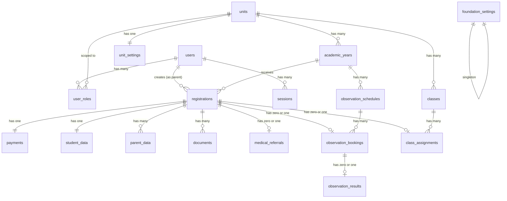

# Database Schema

## SIM-Alfida — Sistem Informasi Manajemen Yayasan Alfida

| Atribut         | Detail                                          |
| --------------- | ----------------------------------------------- |
| **Versi**       | 0.1.0-alpha                                     |
| **Tanggal**     | 6 Agustus 2026                                  |
| **Database**    | Supabase PostgreSQL 15+                         |
| **ORM**         | Prisma (via Connection Pooler)                  |
| **Referensi**   | [PRD.md](file:///home/alchemista/projects/sim-alfida/docs/PRD.md) · [TDD.md](file:///home/alchemista/projects/sim-alfida/docs/TDD.md) |

---

> [!IMPORTANT]
> **Koneksi Supabase:**
> Prisma terhubung ke Supabase dengan dua *connection strings*:
> - `DATABASE_URL`: Menggunakan Transaction Pooler (Port `6543`) untuk operasional *runtime*.
> - `DIRECT_URL`: Menggunakan Direct Connection (Port `5432`) untuk menjalankan migrasi Prisma.
> 
> Pengguna pada aplikasi (tabel `users`) akan dikelola secara SSR menggunakan **Supabase Auth** (`auth.users`).

---

## 1. Konvensi

| Aspek                  | Aturan                                                                   |
| ---------------------- | ------------------------------------------------------------------------ |
| **Naming**             | `snake_case` untuk tabel dan kolom                                       |
| **Primary Key**        | `UUID v7` (time-sortable) — kolom `id`                                   |
| **Foreign Key**        | `{referenced_table_singular}_id`, misal `unit_id`                        |
| **Timestamps**         | `created_at` (NOT NULL, DEFAULT NOW), `updated_at` (nullable, auto-set) |
| **Soft Delete**        | Tidak digunakan pada fase awal                                           |
| **Enum**               | PostgreSQL native enum type                                              |
| **Index Naming**       | `idx_{table}_{column(s)}`                                                |
| **Unique Constraint**  | `uq_{table}_{column(s)}`                                                |
| **Check Constraint**   | `ck_{table}_{description}`                                               |

---

## 2. Entity Relationship Diagram



---

## 3. Enum Types

```sql
-- ── Enum: Jenjang unit pendidikan ──
CREATE TYPE unit_level AS ENUM (
    'tk',
    'sd',
    'smp',
    'sma',
    'pesantren'
);

-- ── Enum: Peran pengguna ──
CREATE TYPE user_role AS ENUM (
    'super_admin',
    'admin_unit',
    'guru',
    'karyawan',
    'orang_tua',
    'observer',
    'tim_ppdb'
);

-- ── Enum: Status pendaftaran PPDB ──
CREATE TYPE registration_status AS ENUM (
    'pending_payment',
    'payment_uploaded',
    'payment_verified',
    'form_filling',
    'documents_uploaded',
    'medical_pending',
    'medical_uploaded',
    'verification',
    'observation_scheduled',
    'observation_done',
    'accepted',
    'rejected',
    'enrolled'
);

-- ── Enum: Status pembayaran ──
CREATE TYPE payment_status AS ENUM (
    'pending',
    'uploaded',
    'verified',
    'rejected'
);

-- ── Enum: Jenis kelamin ──
CREATE TYPE gender AS ENUM (
    'male',
    'female'
);

-- ── Enum: Tipe orang tua / wali ──
CREATE TYPE parent_type AS ENUM (
    'father',
    'mother',
    'guardian'
);

-- ── Enum: Tipe dokumen ──
CREATE TYPE document_type AS ENUM (
    'photo',
    'school_certificate',
    'birth_certificate',
    'family_card',
    'father_id',
    'mother_id',
    'medical_result'
);
```

---

## 4. Tabel — Foundation & Unit

### 4.1 `foundation_settings`

Settings global yayasan. Tabel singleton (hanya 1 row).

```sql
CREATE TABLE foundation_settings (
    id              UUID PRIMARY KEY DEFAULT gen_random_uuid(),
    foundation_name VARCHAR(200)  NOT NULL DEFAULT 'Yayasan Alfida',
    logo_url        TEXT,
    bank_name       VARCHAR(100),
    bank_account_number VARCHAR(50),
    bank_account_holder VARCHAR(200),
    created_at      TIMESTAMPTZ   NOT NULL DEFAULT NOW(),
    updated_at      TIMESTAMPTZ
);

-- Pastikan hanya ada 1 row
CREATE UNIQUE INDEX uq_foundation_settings_singleton ON foundation_settings ((true));
```

| Kolom                  | Tipe           | Nullable | Keterangan                            |
| ---------------------- | -------------- | :------: | ------------------------------------- |
| `id`                   | UUID           | ❌       | PK                                    |
| `foundation_name`      | VARCHAR(200)   | ❌       | Nama yayasan                          |
| `logo_url`             | TEXT           | ✅       | URL logo yayasan di object storage    |
| `bank_name`            | VARCHAR(100)   | ✅       | Nama bank rekening yayasan            |
| `bank_account_number`  | VARCHAR(50)    | ✅       | Nomor rekening                        |
| `bank_account_holder`  | VARCHAR(200)   | ✅       | Nama pemilik rekening                 |
| `created_at`           | TIMESTAMPTZ    | ❌       | DEFAULT NOW()                         |
| `updated_at`           | TIMESTAMPTZ    | ✅       | Auto-set on update                    |

---

### 4.2 `units`

Daftar unit pendidikan di bawah yayasan.

```sql
CREATE TABLE units (
    id              UUID PRIMARY KEY DEFAULT gen_random_uuid(),
    name            VARCHAR(200)  NOT NULL,
    slug            VARCHAR(100)  NOT NULL,
    level           unit_level    NOT NULL,
    is_active       BOOLEAN       NOT NULL DEFAULT true,
    created_at      TIMESTAMPTZ   NOT NULL DEFAULT NOW(),
    updated_at      TIMESTAMPTZ,

    CONSTRAINT uq_units_slug UNIQUE (slug)
);

CREATE INDEX idx_units_level ON units (level);
CREATE INDEX idx_units_is_active ON units (is_active) WHERE is_active = true;
```

| Kolom       | Tipe          | Nullable | Keterangan                                    |
| ----------- | ------------- | :------: | --------------------------------------------- |
| `id`        | UUID          | ❌       | PK                                            |
| `name`      | VARCHAR(200)  | ❌       | Nama lengkap unit, misal "SD Islam Terpadu Iqra 1" |
| `slug`      | VARCHAR(100)  | ❌       | URL-safe identifier, UNIQUE                   |
| `level`     | unit_level    | ❌       | Jenjang: tk, sd, smp, sma, pesantren          |
| `is_active` | BOOLEAN       | ❌       | DEFAULT true                                  |
| `created_at`| TIMESTAMPTZ   | ❌       | DEFAULT NOW()                                 |
| `updated_at`| TIMESTAMPTZ   | ✅       | Auto-set on update                            |

**Seed data awal:**

| name                            | slug                   | level      |
| ------------------------------- | ---------------------- | ---------- |
| TK Islam Terpadu Auladuna 1     | tkit-auladuna-1        | tk         |
| TK Islam Terpadu Auladuna 2     | tkit-auladuna-2        | tk         |
| SD Islam Terpadu Iqra 1         | sdit-iqra-1            | sd         |
| SD Islam Terpadu Iqra 2         | sdit-iqra-2            | sd         |
| SD Islam Terpadu Iqra 3         | sdit-iqra-3            | sd         |
| SMP Islam Terpadu Iqra          | smpit-iqra             | smp        |
| SMA Islam Terpadu Iqra          | smait-iqra             | sma        |
| Pesantren Quran Alfida          | pesantren-quran-alfida | pesantren  |

---

### 4.3 `unit_settings`

Konfigurasi per-unit (logo, tanda tangan kepala sekolah).

```sql
CREATE TABLE unit_settings (
    id                       UUID PRIMARY KEY DEFAULT gen_random_uuid(),
    unit_id                  UUID          NOT NULL,
    logo_url                 TEXT,
    principal_name           VARCHAR(200),
    principal_nip            VARCHAR(50),
    principal_signature_url  TEXT,
    created_at               TIMESTAMPTZ   NOT NULL DEFAULT NOW(),
    updated_at               TIMESTAMPTZ,

    CONSTRAINT fk_unit_settings_unit FOREIGN KEY (unit_id)
        REFERENCES units (id) ON DELETE CASCADE,
    CONSTRAINT uq_unit_settings_unit UNIQUE (unit_id)
);
```

| Kolom                      | Tipe          | Nullable | Keterangan                              |
| -------------------------- | ------------- | :------: | --------------------------------------- |
| `id`                       | UUID          | ❌       | PK                                      |
| `unit_id`                  | UUID          | ❌       | FK → units.id, UNIQUE (one-to-one)      |
| `logo_url`                 | TEXT          | ✅       | URL logo unit di object storage         |
| `principal_name`           | VARCHAR(200)  | ✅       | Nama kepala sekolah                     |
| `principal_nip`            | VARCHAR(50)   | ✅       | NIP kepala sekolah                      |
| `principal_signature_url`  | TEXT          | ✅       | URL gambar tanda tangan kepala sekolah  |
| `created_at`               | TIMESTAMPTZ   | ❌       | DEFAULT NOW()                           |
| `updated_at`               | TIMESTAMPTZ   | ✅       | Auto-set on update                      |

---

## 5. Tabel — Auth & Users

### 5.1 `users`

```sql
CREATE TABLE users (
    id              UUID PRIMARY KEY DEFAULT gen_random_uuid(),
    name            VARCHAR(200)  NOT NULL,
    email           VARCHAR(255)  NOT NULL,
    phone           VARCHAR(20),
    password_hash   TEXT          NOT NULL,
    is_active       BOOLEAN       NOT NULL DEFAULT true,
    created_at      TIMESTAMPTZ   NOT NULL DEFAULT NOW(),
    updated_at      TIMESTAMPTZ,

    CONSTRAINT uq_users_email UNIQUE (email)
);

CREATE INDEX idx_users_email ON users (email);
CREATE INDEX idx_users_is_active ON users (is_active) WHERE is_active = true;
```

| Kolom          | Tipe          | Nullable | Keterangan                           |
| -------------- | ------------- | :------: | ------------------------------------ |
| `id`           | UUID          | ❌       | PK                                   |
| `name`         | VARCHAR(200)  | ❌       | Nama lengkap                         |
| `email`        | VARCHAR(255)  | ❌       | Email unik untuk login               |
| `phone`        | VARCHAR(20)   | ✅       | No. WA/HP                           |
| `password_hash`| TEXT          | ❌       | bcrypt hash (salt ≥ 12)              |
| `is_active`    | BOOLEAN       | ❌       | DEFAULT true                         |
| `created_at`   | TIMESTAMPTZ   | ❌       | DEFAULT NOW()                        |
| `updated_at`   | TIMESTAMPTZ   | ✅       | Auto-set on update                   |

---

### 5.2 `user_roles`

Mapping user ke role per-unit. User bisa memiliki multiple roles.

```sql
CREATE TABLE user_roles (
    id          UUID PRIMARY KEY DEFAULT gen_random_uuid(),
    user_id     UUID        NOT NULL,
    unit_id     UUID,                     -- NULL untuk super_admin
    role        user_role   NOT NULL,
    created_at  TIMESTAMPTZ NOT NULL DEFAULT NOW(),

    CONSTRAINT fk_user_roles_user FOREIGN KEY (user_id)
        REFERENCES users (id) ON DELETE CASCADE,
    CONSTRAINT fk_user_roles_unit FOREIGN KEY (unit_id)
        REFERENCES units (id) ON DELETE CASCADE,
    CONSTRAINT uq_user_roles_user_unit_role UNIQUE (user_id, unit_id, role),
    CONSTRAINT ck_user_roles_super_admin_no_unit
        CHECK (
            (role = 'super_admin' AND unit_id IS NULL)
            OR (role != 'super_admin' AND unit_id IS NOT NULL)
        )
);

CREATE INDEX idx_user_roles_user ON user_roles (user_id);
CREATE INDEX idx_user_roles_unit ON user_roles (unit_id);
CREATE INDEX idx_user_roles_role ON user_roles (role);
```

| Kolom       | Tipe       | Nullable | Keterangan                                            |
| ----------- | ---------- | :------: | ----------------------------------------------------- |
| `id`        | UUID       | ❌       | PK                                                    |
| `user_id`   | UUID       | ❌       | FK → users.id                                         |
| `unit_id`   | UUID       | ✅       | FK → units.id, NULL jika `super_admin`                |
| `role`      | user_role  | ❌       | Peran user di unit tersebut                           |
| `created_at`| TIMESTAMPTZ| ❌       | DEFAULT NOW()                                         |

> [!IMPORTANT]
> Check constraint `ck_user_roles_super_admin_no_unit` memastikan bahwa `super_admin` tidak memiliki `unit_id`, dan semua role lain **wajib** memiliki `unit_id`.

---

### 5.3 `sessions`

Sesi autentikasi (NextAuth database strategy).

```sql
CREATE TABLE sessions (
    id              UUID PRIMARY KEY DEFAULT gen_random_uuid(),
    user_id         UUID          NOT NULL,
    session_token   VARCHAR(500)  NOT NULL,
    expires_at      TIMESTAMPTZ   NOT NULL,
    created_at      TIMESTAMPTZ   NOT NULL DEFAULT NOW(),

    CONSTRAINT fk_sessions_user FOREIGN KEY (user_id)
        REFERENCES users (id) ON DELETE CASCADE,
    CONSTRAINT uq_sessions_token UNIQUE (session_token)
);

CREATE INDEX idx_sessions_user ON sessions (user_id);
CREATE INDEX idx_sessions_expires ON sessions (expires_at);
```

| Kolom           | Tipe          | Nullable | Keterangan                     |
| --------------- | ------------- | :------: | ------------------------------ |
| `id`            | UUID          | ❌       | PK                             |
| `user_id`       | UUID          | ❌       | FK → users.id                  |
| `session_token` | VARCHAR(500)  | ❌       | Token sesi, UNIQUE             |
| `expires_at`    | TIMESTAMPTZ   | ❌       | Waktu kedaluwarsa              |
| `created_at`    | TIMESTAMPTZ   | ❌       | DEFAULT NOW()                  |

---

## 6. Tabel — PPDB

### 6.1 `academic_years`

Tahun ajaran per-unit. Mengontrol PPDB aktif dan kuota.

```sql
CREATE TABLE academic_years (
    id               UUID PRIMARY KEY DEFAULT gen_random_uuid(),
    unit_id          UUID          NOT NULL,
    name             VARCHAR(20)   NOT NULL,  -- e.g. "2026/2027"
    start_date       DATE          NOT NULL,
    end_date         DATE          NOT NULL,
    ppdb_active      BOOLEAN       NOT NULL DEFAULT false,
    ppdb_quota       INTEGER       NOT NULL DEFAULT 0,
    ppdb_registered  INTEGER       NOT NULL DEFAULT 0,
    created_at       TIMESTAMPTZ   NOT NULL DEFAULT NOW(),
    updated_at       TIMESTAMPTZ,

    CONSTRAINT fk_academic_years_unit FOREIGN KEY (unit_id)
        REFERENCES units (id) ON DELETE CASCADE,
    CONSTRAINT uq_academic_years_unit_name UNIQUE (unit_id, name),
    CONSTRAINT ck_academic_years_dates CHECK (start_date < end_date),
    CONSTRAINT ck_academic_years_quota CHECK (ppdb_quota >= 0),
    CONSTRAINT ck_academic_years_registered CHECK (ppdb_registered >= 0)
);

CREATE INDEX idx_academic_years_unit ON academic_years (unit_id);
CREATE INDEX idx_academic_years_ppdb_active ON academic_years (ppdb_active) WHERE ppdb_active = true;
```

| Kolom             | Tipe          | Nullable | Keterangan                                |
| ----------------- | ------------- | :------: | ----------------------------------------- |
| `id`              | UUID          | ❌       | PK                                        |
| `unit_id`         | UUID          | ❌       | FK → units.id                             |
| `name`            | VARCHAR(20)   | ❌       | Nama tahun ajaran, e.g. "2026/2027"       |
| `start_date`      | DATE          | ❌       | Tanggal mulai tahun ajaran                |
| `end_date`        | DATE          | ❌       | Tanggal akhir tahun ajaran                |
| `ppdb_active`     | BOOLEAN       | ❌       | Apakah PPDB sedang aktif                  |
| `ppdb_quota`      | INTEGER       | ❌       | Kuota penerimaan siswa baru               |
| `ppdb_registered` | INTEGER       | ❌       | Counter siswa yang sudah terdaftar        |
| `created_at`      | TIMESTAMPTZ   | ❌       | DEFAULT NOW()                             |
| `updated_at`      | TIMESTAMPTZ   | ✅       | Auto-set on update                        |

---

### 6.2 `registrations`

Pendaftaran PPDB oleh orang tua.

```sql
CREATE TABLE registrations (
    id                   UUID PRIMARY KEY DEFAULT gen_random_uuid(),
    user_id              UUID                NOT NULL,  -- orang tua
    academic_year_id     UUID                NOT NULL,
    unit_id              UUID                NOT NULL,
    registration_number  VARCHAR(30)         NOT NULL,
    status               registration_status NOT NULL DEFAULT 'pending_payment',
    created_at           TIMESTAMPTZ         NOT NULL DEFAULT NOW(),
    updated_at           TIMESTAMPTZ,

    CONSTRAINT fk_registrations_user FOREIGN KEY (user_id)
        REFERENCES users (id) ON DELETE RESTRICT,
    CONSTRAINT fk_registrations_academic_year FOREIGN KEY (academic_year_id)
        REFERENCES academic_years (id) ON DELETE RESTRICT,
    CONSTRAINT fk_registrations_unit FOREIGN KEY (unit_id)
        REFERENCES units (id) ON DELETE RESTRICT,
    CONSTRAINT uq_registrations_number UNIQUE (registration_number),
    CONSTRAINT uq_registrations_user_year UNIQUE (user_id, academic_year_id)
);

CREATE INDEX idx_registrations_user ON registrations (user_id);
CREATE INDEX idx_registrations_unit ON registrations (unit_id);
CREATE INDEX idx_registrations_academic_year ON registrations (academic_year_id);
CREATE INDEX idx_registrations_status ON registrations (status);
```

| Kolom                 | Tipe                 | Nullable | Keterangan                                          |
| --------------------- | -------------------- | :------: | --------------------------------------------------- |
| `id`                  | UUID                 | ❌       | PK                                                  |
| `user_id`             | UUID                 | ❌       | FK → users.id (orang tua)                           |
| `academic_year_id`    | UUID                 | ❌       | FK → academic_years.id                              |
| `unit_id`             | UUID                 | ❌       | FK → units.id (denormalized untuk query cepat)      |
| `registration_number` | VARCHAR(30)          | ❌       | Nomor registrasi unik, e.g. "PPDB-SDIT1-2026-0001" |
| `status`              | registration_status  | ❌       | Status pendaftaran (state machine)                  |
| `created_at`          | TIMESTAMPTZ          | ❌       | DEFAULT NOW()                                       |
| `updated_at`          | TIMESTAMPTZ          | ✅       | Auto-set on update                                  |

> [!NOTE]
> Unique constraint `uq_registrations_user_year` mencegah satu orang tua mendaftar dua kali di tahun ajaran yang sama pada unit yang sama.

**Format `registration_number`:** `PPDB-{SLUG_UNIT}-{TAHUN}-{SEQUENCE_4_DIGIT}`
Contoh: `PPDB-SDIT1-2026-0042`

---

### 6.3 `payments`

Pembayaran pendaftaran PPDB.

```sql
CREATE TABLE payments (
    id               UUID PRIMARY KEY DEFAULT gen_random_uuid(),
    registration_id  UUID            NOT NULL,
    amount           DECIMAL(12, 2)  NOT NULL,
    proof_url        TEXT,
    status           payment_status  NOT NULL DEFAULT 'pending',
    verified_by      UUID,
    rejection_reason TEXT,
    verified_at      TIMESTAMPTZ,
    created_at       TIMESTAMPTZ     NOT NULL DEFAULT NOW(),
    updated_at       TIMESTAMPTZ,

    CONSTRAINT fk_payments_registration FOREIGN KEY (registration_id)
        REFERENCES registrations (id) ON DELETE CASCADE,
    CONSTRAINT fk_payments_verified_by FOREIGN KEY (verified_by)
        REFERENCES users (id) ON DELETE SET NULL,
    CONSTRAINT uq_payments_registration UNIQUE (registration_id),
    CONSTRAINT ck_payments_amount CHECK (amount > 0)
);

CREATE INDEX idx_payments_status ON payments (status);
CREATE INDEX idx_payments_registration ON payments (registration_id);
```

| Kolom              | Tipe           | Nullable | Keterangan                              |
| ------------------ | -------------- | :------: | --------------------------------------- |
| `id`               | UUID           | ❌       | PK                                      |
| `registration_id`  | UUID           | ❌       | FK → registrations.id, UNIQUE           |
| `amount`           | DECIMAL(12,2)  | ❌       | Nominal pembayaran                      |
| `proof_url`        | TEXT           | ✅       | URL bukti transfer di object storage    |
| `status`           | payment_status | ❌       | Status verifikasi                       |
| `verified_by`      | UUID           | ✅       | FK → users.id (admin yang verifikasi)   |
| `rejection_reason` | TEXT           | ✅       | Alasan penolakan (jika ditolak)         |
| `verified_at`      | TIMESTAMPTZ    | ✅       | Waktu verifikasi                        |
| `created_at`       | TIMESTAMPTZ    | ❌       | DEFAULT NOW()                           |
| `updated_at`       | TIMESTAMPTZ    | ✅       | Auto-set on update                      |

---

### 6.4 `student_data`

Data calon peserta didik baru.

```sql
CREATE TABLE student_data (
    id               UUID PRIMARY KEY DEFAULT gen_random_uuid(),
    registration_id  UUID          NOT NULL,
    full_name        VARCHAR(200)  NOT NULL,
    nickname         VARCHAR(50)   NOT NULL,
    gender           gender        NOT NULL,
    religion         VARCHAR(20)   NOT NULL DEFAULT 'Islam',
    birth_place      VARCHAR(100)  NOT NULL,
    birth_date       DATE          NOT NULL,
    nisn             VARCHAR(10),
    sibling_count    INTEGER       NOT NULL DEFAULT 0,
    address          TEXT          NOT NULL,
    transportation   VARCHAR(100),
    hobby            VARCHAR(200),
    aspiration       VARCHAR(200),
    created_at       TIMESTAMPTZ   NOT NULL DEFAULT NOW(),
    updated_at       TIMESTAMPTZ,

    CONSTRAINT fk_student_data_registration FOREIGN KEY (registration_id)
        REFERENCES registrations (id) ON DELETE CASCADE,
    CONSTRAINT uq_student_data_registration UNIQUE (registration_id),
    CONSTRAINT ck_student_data_sibling CHECK (sibling_count >= 0)
);

CREATE INDEX idx_student_data_registration ON student_data (registration_id);
CREATE INDEX idx_student_data_nisn ON student_data (nisn) WHERE nisn IS NOT NULL;
```

| Kolom             | Tipe          | Nullable | Keterangan                                   |
| ----------------- | ------------- | :------: | -------------------------------------------- |
| `id`              | UUID          | ❌       | PK                                           |
| `registration_id` | UUID          | ❌       | FK → registrations.id, UNIQUE                |
| `full_name`       | VARCHAR(200)  | ❌       | Nama lengkap siswa                           |
| `nickname`        | VARCHAR(50)   | ❌       | Nama panggilan                               |
| `gender`          | gender        | ❌       | Jenis kelamin                                |
| `religion`        | VARCHAR(20)   | ❌       | DEFAULT 'Islam'                              |
| `birth_place`     | VARCHAR(100)  | ❌       | Tempat lahir                                 |
| `birth_date`      | DATE          | ❌       | Tanggal lahir                                |
| `nisn`            | VARCHAR(10)   | ✅       | NISN (nullable untuk TK yang belum punya)    |
| `sibling_count`   | INTEGER       | ❌       | Jumlah saudara                               |
| `address`         | TEXT          | ❌       | Alamat lengkap                               |
| `transportation`  | VARCHAR(100)  | ✅       | Alat transportasi ke sekolah                 |
| `hobby`           | VARCHAR(200)  | ✅       | Hobi                                         |
| `aspiration`      | VARCHAR(200)  | ✅       | Cita-cita                                    |
| `created_at`      | TIMESTAMPTZ   | ❌       | DEFAULT NOW()                                |
| `updated_at`      | TIMESTAMPTZ   | ✅       | Auto-set on update                           |

---

### 6.5 `parent_data`

Data orang tua / wali calon siswa. Satu registrasi bisa punya data ayah, ibu, dan/atau wali.

```sql
CREATE TABLE parent_data (
    id               UUID PRIMARY KEY DEFAULT gen_random_uuid(),
    registration_id  UUID          NOT NULL,
    type             parent_type   NOT NULL,
    full_name        VARCHAR(200)  NOT NULL,
    nik              VARCHAR(16)   NOT NULL,
    birth_place      VARCHAR(100),
    birth_date       DATE,
    education        VARCHAR(50),
    occupation       VARCHAR(100),
    phone            VARCHAR(20),
    income_range     VARCHAR(50),
    address          TEXT,
    created_at       TIMESTAMPTZ   NOT NULL DEFAULT NOW(),
    updated_at       TIMESTAMPTZ,

    CONSTRAINT fk_parent_data_registration FOREIGN KEY (registration_id)
        REFERENCES registrations (id) ON DELETE CASCADE,
    CONSTRAINT uq_parent_data_registration_type UNIQUE (registration_id, type)
);

CREATE INDEX idx_parent_data_registration ON parent_data (registration_id);
```

| Kolom             | Tipe          | Nullable | Keterangan                                         |
| ----------------- | ------------- | :------: | -------------------------------------------------- |
| `id`              | UUID          | ❌       | PK                                                 |
| `registration_id` | UUID          | ❌       | FK → registrations.id                              |
| `type`            | parent_type   | ❌       | father / mother / guardian                         |
| `full_name`       | VARCHAR(200)  | ❌       | Nama lengkap orang tua                             |
| `nik`             | VARCHAR(16)   | ❌       | NIK (16 digit)                                     |
| `birth_place`     | VARCHAR(100)  | ✅       | Tempat lahir                                       |
| `birth_date`      | DATE          | ✅       | Tanggal lahir                                      |
| `education`       | VARCHAR(50)   | ✅       | Pendidikan terakhir                                |
| `occupation`      | VARCHAR(100)  | ✅       | Pekerjaan                                          |
| `phone`           | VARCHAR(20)   | ✅       | Nomor telepon                                      |
| `income_range`    | VARCHAR(50)   | ✅       | Kisaran penghasilan (e.g. "< 2 Juta", "2-5 Juta") |
| `address`         | TEXT          | ✅       | Alamat lengkap                                     |
| `created_at`      | TIMESTAMPTZ   | ❌       | DEFAULT NOW()                                      |
| `updated_at`      | TIMESTAMPTZ   | ✅       | Auto-set on update                                 |

> [!NOTE]
> Unique constraint `uq_parent_data_registration_type` memastikan satu registrasi hanya boleh punya satu entri per tipe (satu ayah, satu ibu, satu wali).

---

### 6.6 `documents`

Berkas yang diunggah oleh orang tua.

```sql
CREATE TABLE documents (
    id               UUID PRIMARY KEY DEFAULT gen_random_uuid(),
    registration_id  UUID           NOT NULL,
    doc_type         document_type  NOT NULL,
    file_url         TEXT           NOT NULL,
    file_name        VARCHAR(255)   NOT NULL,
    file_size        INTEGER        NOT NULL,  -- dalam byte
    mime_type        VARCHAR(100)   NOT NULL,
    uploaded_at      TIMESTAMPTZ    NOT NULL DEFAULT NOW(),

    CONSTRAINT fk_documents_registration FOREIGN KEY (registration_id)
        REFERENCES registrations (id) ON DELETE CASCADE,
    CONSTRAINT uq_documents_registration_type UNIQUE (registration_id, doc_type),
    CONSTRAINT ck_documents_file_size CHECK (file_size > 0 AND file_size <= 5242880),
    CONSTRAINT ck_documents_mime_type CHECK (
        mime_type IN ('image/jpeg', 'image/png', 'application/pdf')
    )
);

CREATE INDEX idx_documents_registration ON documents (registration_id);
```

| Kolom             | Tipe           | Nullable | Keterangan                                 |
| ----------------- | -------------- | :------: | ------------------------------------------ |
| `id`              | UUID           | ❌       | PK                                         |
| `registration_id` | UUID           | ❌       | FK → registrations.id                      |
| `doc_type`        | document_type  | ❌       | Jenis dokumen                              |
| `file_url`        | TEXT           | ❌       | URL file di object storage                 |
| `file_name`       | VARCHAR(255)   | ❌       | Nama file asli                             |
| `file_size`       | INTEGER        | ❌       | Ukuran file dalam byte (max 5MB)           |
| `mime_type`       | VARCHAR(100)   | ❌       | MIME type (jpeg, png, pdf)                 |
| `uploaded_at`     | TIMESTAMPTZ    | ❌       | DEFAULT NOW()                              |

---

### 6.7 `medical_referrals`

Surat pengantar pemeriksaan ke Klinik IMC.

```sql
CREATE TABLE medical_referrals (
    id               UUID PRIMARY KEY DEFAULT gen_random_uuid(),
    registration_id  UUID        NOT NULL,
    pdf_url          TEXT        NOT NULL,
    generated_at     TIMESTAMPTZ NOT NULL DEFAULT NOW(),

    CONSTRAINT fk_medical_referrals_registration FOREIGN KEY (registration_id)
        REFERENCES registrations (id) ON DELETE CASCADE,
    CONSTRAINT uq_medical_referrals_registration UNIQUE (registration_id)
);
```

| Kolom             | Tipe        | Nullable | Keterangan                           |
| ----------------- | ----------- | :------: | ------------------------------------ |
| `id`              | UUID        | ❌       | PK                                   |
| `registration_id` | UUID        | ❌       | FK → registrations.id, UNIQUE        |
| `pdf_url`         | TEXT        | ❌       | URL PDF surat pengantar              |
| `generated_at`    | TIMESTAMPTZ | ❌       | DEFAULT NOW()                        |

---

## 7. Tabel — Observasi

### 7.1 `observation_schedules`

Jadwal observasi yang dibuat oleh admin unit.

```sql
CREATE TABLE observation_schedules (
    id               UUID PRIMARY KEY DEFAULT gen_random_uuid(),
    academic_year_id UUID        NOT NULL,
    unit_id          UUID        NOT NULL,
    schedule_date    DATE        NOT NULL,
    daily_quota      INTEGER     NOT NULL,
    booked_count     INTEGER     NOT NULL DEFAULT 0,
    created_at       TIMESTAMPTZ NOT NULL DEFAULT NOW(),

    CONSTRAINT fk_observation_schedules_academic_year FOREIGN KEY (academic_year_id)
        REFERENCES academic_years (id) ON DELETE CASCADE,
    CONSTRAINT fk_observation_schedules_unit FOREIGN KEY (unit_id)
        REFERENCES units (id) ON DELETE CASCADE,
    CONSTRAINT uq_observation_schedules_unit_date UNIQUE (unit_id, academic_year_id, schedule_date),
    CONSTRAINT ck_observation_schedules_quota CHECK (daily_quota > 0),
    CONSTRAINT ck_observation_schedules_booked CHECK (booked_count >= 0 AND booked_count <= daily_quota)
);

CREATE INDEX idx_observation_schedules_unit ON observation_schedules (unit_id);
CREATE INDEX idx_observation_schedules_date ON observation_schedules (schedule_date);
```

| Kolom              | Tipe        | Nullable | Keterangan                                   |
| ------------------ | ----------- | :------: | -------------------------------------------- |
| `id`               | UUID        | ❌       | PK                                           |
| `academic_year_id` | UUID        | ❌       | FK → academic_years.id                       |
| `unit_id`          | UUID        | ❌       | FK → units.id                                |
| `schedule_date`    | DATE        | ❌       | Tanggal observasi                            |
| `daily_quota`      | INTEGER     | ❌       | Kuota harian                                 |
| `booked_count`     | INTEGER     | ❌       | Counter booking (≤ daily_quota)              |
| `created_at`       | TIMESTAMPTZ | ❌       | DEFAULT NOW()                                |

---

### 7.2 `observation_bookings`

Booking jadwal observasi oleh orang tua.

```sql
CREATE TABLE observation_bookings (
    id               UUID PRIMARY KEY DEFAULT gen_random_uuid(),
    registration_id  UUID        NOT NULL,
    schedule_id      UUID        NOT NULL,
    booked_at        TIMESTAMPTZ NOT NULL DEFAULT NOW(),

    CONSTRAINT fk_observation_bookings_registration FOREIGN KEY (registration_id)
        REFERENCES registrations (id) ON DELETE CASCADE,
    CONSTRAINT fk_observation_bookings_schedule FOREIGN KEY (schedule_id)
        REFERENCES observation_schedules (id) ON DELETE CASCADE,
    CONSTRAINT uq_observation_bookings_registration UNIQUE (registration_id)
);

CREATE INDEX idx_observation_bookings_schedule ON observation_bookings (schedule_id);
```

| Kolom             | Tipe        | Nullable | Keterangan                         |
| ----------------- | ----------- | :------: | ---------------------------------- |
| `id`              | UUID        | ❌       | PK                                 |
| `registration_id` | UUID        | ❌       | FK → registrations.id, UNIQUE      |
| `schedule_id`     | UUID        | ❌       | FK → observation_schedules.id      |
| `booked_at`       | TIMESTAMPTZ | ❌       | DEFAULT NOW()                      |

---

### 7.3 `observation_results`

Hasil observasi yang diinput oleh observer.

```sql
CREATE TABLE observation_results (
    id           UUID PRIMARY KEY DEFAULT gen_random_uuid(),
    booking_id   UUID           NOT NULL,
    observer_id  UUID           NOT NULL,
    score        DECIMAL(5, 2)  NOT NULL,
    notes        TEXT,
    rank         INTEGER,       -- computed after all scores submitted
    created_at   TIMESTAMPTZ    NOT NULL DEFAULT NOW(),
    updated_at   TIMESTAMPTZ,

    CONSTRAINT fk_observation_results_booking FOREIGN KEY (booking_id)
        REFERENCES observation_bookings (id) ON DELETE CASCADE,
    CONSTRAINT fk_observation_results_observer FOREIGN KEY (observer_id)
        REFERENCES users (id) ON DELETE RESTRICT,
    CONSTRAINT uq_observation_results_booking UNIQUE (booking_id),
    CONSTRAINT ck_observation_results_score CHECK (score >= 0 AND score <= 100)
);

CREATE INDEX idx_observation_results_observer ON observation_results (observer_id);
CREATE INDEX idx_observation_results_score ON observation_results (score DESC);
```

| Kolom         | Tipe          | Nullable | Keterangan                                 |
| ------------- | ------------- | :------: | ------------------------------------------ |
| `id`          | UUID          | ❌       | PK                                         |
| `booking_id`  | UUID          | ❌       | FK → observation_bookings.id, UNIQUE       |
| `observer_id` | UUID          | ❌       | FK → users.id (observer yang menilai)      |
| `score`       | DECIMAL(5,2)  | ❌       | Skor observasi (0.00–100.00)               |
| `notes`       | TEXT          | ✅       | Catatan dari observer                      |
| `rank`        | INTEGER       | ✅       | Peringkat (dihitung setelah semua skor masuk) |
| `created_at`  | TIMESTAMPTZ   | ❌       | DEFAULT NOW()                              |
| `updated_at`  | TIMESTAMPTZ   | ✅       | Auto-set on update                         |

---

## 8. Tabel — Kelas

### 8.1 `classes`

Kelas paralel di setiap unit.

```sql
CREATE TABLE classes (
    id               UUID PRIMARY KEY DEFAULT gen_random_uuid(),
    unit_id          UUID         NOT NULL,
    academic_year_id UUID         NOT NULL,
    name             VARCHAR(10)  NOT NULL,  -- e.g. "1A", "1B"
    grade            INTEGER      NOT NULL,  -- e.g. 1, 2, 3
    capacity         INTEGER      NOT NULL DEFAULT 30,
    created_at       TIMESTAMPTZ  NOT NULL DEFAULT NOW(),

    CONSTRAINT fk_classes_unit FOREIGN KEY (unit_id)
        REFERENCES units (id) ON DELETE CASCADE,
    CONSTRAINT fk_classes_academic_year FOREIGN KEY (academic_year_id)
        REFERENCES academic_years (id) ON DELETE CASCADE,
    CONSTRAINT uq_classes_unit_year_name UNIQUE (unit_id, academic_year_id, name),
    CONSTRAINT ck_classes_capacity CHECK (capacity > 0),
    CONSTRAINT ck_classes_grade CHECK (grade > 0)
);

CREATE INDEX idx_classes_unit ON classes (unit_id);
CREATE INDEX idx_classes_academic_year ON classes (academic_year_id);
```

| Kolom              | Tipe        | Nullable | Keterangan                              |
| ------------------ | ----------- | :------: | --------------------------------------- |
| `id`               | UUID        | ❌       | PK                                      |
| `unit_id`          | UUID        | ❌       | FK → units.id                           |
| `academic_year_id` | UUID        | ❌       | FK → academic_years.id                  |
| `name`             | VARCHAR(10) | ❌       | Nama kelas, e.g. "1A", "1B"            |
| `grade`            | INTEGER     | ❌       | Tingkat kelas (1, 2, 3, dst.)           |
| `capacity`         | INTEGER     | ❌       | Kapasitas kelas, DEFAULT 30             |
| `created_at`       | TIMESTAMPTZ | ❌       | DEFAULT NOW()                           |

---

### 8.2 `class_assignments`

Penempatan siswa baru ke kelas.

```sql
CREATE TABLE class_assignments (
    id               UUID PRIMARY KEY DEFAULT gen_random_uuid(),
    registration_id  UUID        NOT NULL,
    class_id         UUID        NOT NULL,
    assigned_at      TIMESTAMPTZ NOT NULL DEFAULT NOW(),
    assigned_by      UUID        NOT NULL,

    CONSTRAINT fk_class_assignments_registration FOREIGN KEY (registration_id)
        REFERENCES registrations (id) ON DELETE CASCADE,
    CONSTRAINT fk_class_assignments_class FOREIGN KEY (class_id)
        REFERENCES classes (id) ON DELETE CASCADE,
    CONSTRAINT fk_class_assignments_assigned_by FOREIGN KEY (assigned_by)
        REFERENCES users (id) ON DELETE RESTRICT,
    CONSTRAINT uq_class_assignments_registration UNIQUE (registration_id)
);

CREATE INDEX idx_class_assignments_class ON class_assignments (class_id);
```

| Kolom             | Tipe        | Nullable | Keterangan                                 |
| ----------------- | ----------- | :------: | ------------------------------------------ |
| `id`              | UUID        | ❌       | PK                                         |
| `registration_id` | UUID        | ❌       | FK → registrations.id, UNIQUE              |
| `class_id`        | UUID        | ❌       | FK → classes.id                            |
| `assigned_at`     | TIMESTAMPTZ | ❌       | DEFAULT NOW()                              |
| `assigned_by`     | UUID        | ❌       | FK → users.id (admin yang assign)          |

---

## 9. Ringkasan Tabel

| #  | Tabel                    | Deskripsi                                       | Relasi Utama                  |
| -- | ------------------------ | ----------------------------------------------- | ----------------------------- |
| 1  | `foundation_settings`   | Settings yayasan (singleton)                    | —                             |
| 2  | `units`                 | Unit pendidikan                                 | —                             |
| 3  | `unit_settings`         | Settings per-unit (logo, TTD)                   | → units                      |
| 4  | `users`                 | Akun pengguna                                   | —                             |
| 5  | `user_roles`            | Mapping user-role-unit                          | → users, → units             |
| 6  | `sessions`              | Sesi autentikasi                                | → users                      |
| 7  | `academic_years`        | Tahun ajaran per-unit                           | → units                      |
| 8  | `registrations`         | Pendaftaran PPDB                                | → users, → academic_years, → units |
| 9  | `payments`              | Pembayaran pendaftaran                          | → registrations, → users     |
| 10 | `student_data`          | Data calon siswa                                | → registrations              |
| 11 | `parent_data`           | Data orang tua/wali                             | → registrations              |
| 12 | `documents`             | Berkas yang diunggah                            | → registrations              |
| 13 | `medical_referrals`     | Surat pengantar klinik IMC                      | → registrations              |
| 14 | `observation_schedules` | Jadwal observasi                                | → academic_years, → units    |
| 15 | `observation_bookings`  | Booking observasi                               | → registrations, → observation_schedules |
| 16 | `observation_results`   | Hasil observasi                                 | → observation_bookings, → users |
| 17 | `classes`               | Kelas paralel                                   | → units, → academic_years    |
| 18 | `class_assignments`     | Penempatan siswa ke kelas                       | → registrations, → classes, → users |

**Total: 18 tabel**

---

## 10. Prisma Schema

Implementasi schema database menggunakan Prisma ORM akan disimpan di `prisma/schema.prisma`. Semua model akan didefinisikan dalam satu file tersebut sesuai standar Prisma, dan migrasi akan di-generate otomatis melalui Prisma CLI.

---

## 11. Migration Strategy

| Langkah | Perintah                              | Keterangan                              |
| ------- | ------------------------------------- | --------------------------------------- |
| 1       | `pnpm drizzle-kit generate`           | Generate SQL migration dari schema diff |
| 2       | Review migration file di `src/db/migrations/` | Pastikan SQL aman dan benar        |
| 3       | `pnpm drizzle-kit migrate`            | Jalankan migration ke database          |
| 4       | `pnpm drizzle-kit studio`             | Buka Drizzle Studio untuk inspeksi      |

> [!WARNING]
> Selalu review migration file yang di-generate sebelum menjalankannya, terutama jika ada perubahan destruktif (drop column, rename table, dll.).

---

## 12. Seed Data

```sql
-- ── Foundation Settings ──
INSERT INTO foundation_settings (foundation_name, bank_name, bank_account_number, bank_account_holder)
VALUES ('Yayasan Alfida', NULL, NULL, NULL);

-- ── Units ──
INSERT INTO units (name, slug, level) VALUES
    ('TK Islam Terpadu Auladuna 1',  'tkit-auladuna-1',        'tk'),
    ('TK Islam Terpadu Auladuna 2',  'tkit-auladuna-2',        'tk'),
    ('SD Islam Terpadu Iqra 1',      'sdit-iqra-1',            'sd'),
    ('SD Islam Terpadu Iqra 2',      'sdit-iqra-2',            'sd'),
    ('SD Islam Terpadu Iqra 3',      'sdit-iqra-3',            'sd'),
    ('SMP Islam Terpadu Iqra',       'smpit-iqra',             'smp'),
    ('SMA Islam Terpadu Iqra',       'smait-iqra',             'sma'),
    ('Pesantren Quran Alfida',       'pesantren-quran-alfida', 'pesantren');

-- ── Unit Settings (satu per unit) ──
INSERT INTO unit_settings (unit_id)
SELECT id FROM units;

-- ── Super Admin (password: hash dari password sementara) ──
INSERT INTO users (name, email, phone, password_hash)
VALUES ('Super Admin', 'admin@alfida.sch.id', NULL, '$2b$12$placeholder_hash');

INSERT INTO user_roles (user_id, unit_id, role)
SELECT u.id, NULL, 'super_admin'
FROM users u WHERE u.email = 'admin@alfida.sch.id';
```

---

## 13. Referensi

| Dokumen                                                                | Konten                                 |
| ---------------------------------------------------------------------- | -------------------------------------- |
| [PRD.md](file:///home/alchemista/projects/sim-alfida/docs/PRD.md)      | Fitur detail & user stories            |
| [TDD.md](file:///home/alchemista/projects/sim-alfida/docs/TDD.md)      | Arsitektur teknis & API design         |
| [DESIGN.md](file:///home/alchemista/projects/sim-alfida/DESIGN.md)     | Design system                          |
