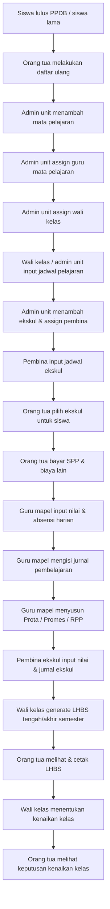
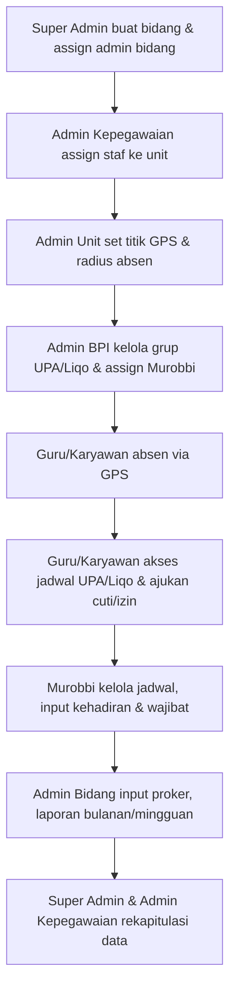

# Product Requirements Document (PRD)

## SIM-Alfida — Sistem Informasi Manajemen Yayasan Alfida

| Atribut         | Detail                                      |
| --------------- | ------------------------------------------- |
| **Versi**       | 0.3.0-alpha                                 |
| **Tanggal**     | 18 Agustus 2026                             |
| **Penulis**     | Tim Pengembangan SIM-Alfida                 |
| **Status**      | Active Development                          |
| **Referensi**   | AGENTS.md · DESIGN.md · PROJECTS.md         |

---

## 1. Ringkasan Eksekutif

SIM-Alfida adalah platform Sistem Informasi Manajemen terpadu untuk Yayasan Alfida yang menaungi **2 TK, 3 SD, 1 SMP, 1 SMA, 1 Pesantren Alquran, dan 1 Kantor Yayasan (Bukan unit pendidikan)**. Sistem ini bertujuan meningkatkan efektivitas dan efisiensi pengelolaan yayasan melalui digitalisasi proses operasional mulai dari penerimaan siswa baru, akademik, surat-menyurat, manajemen karyawan, payroll, hingga rekrutmen.

Platform dibangun dengan arsitektur **multi-tenant** yang memungkinkan setiap unit pendidikan dan kantor yayasan dikelola secara independen di bawah satu sistem terpusat.

---

## 2. Tujuan & Sasaran

### 2.1 Tujuan Bisnis

- Menyatukan seluruh proses administrasi yayasan dalam satu platform terintegrasi
- Mengurangi proses manual dan paper-based di seluruh unit pendidikan
- Meningkatkan transparansi dan akuntabilitas pengelolaan yayasan
- Mempermudah koordinasi antar unit di bawah naungan yayasan

### 2.2 Sasaran Terukur

| Sasaran                                             | Target           |
| --------------------------------------------------- | ---------------- |
| Digitalisasi proses PPDB seluruh unit                | 100%             |
| Pengurangan waktu proses administrasi PPDB           | ≥ 50%            |
| Adopsi sistem oleh seluruh unit pendidikan/yayasan         | 9/9 unit         |

---

## 3. Tech Stack

| Layer            | Teknologi                                         |
| ---------------- | ------------------------------------------------- |
| **Monorepo**     | Turborepo (pnpm workspaces)                       |
| **Frontend**     | Next.js (React · App Router) — `apps/web`         |
| **Backend**      | NestJS (REST API) — `apps/api`                    |
| **Bahasa**       | TypeScript (strict, no `any`)                     |
| **Auth**         | Supabase Auth (SSR) — Identity Provider only      |
| **Database**     | PostgreSQL (Docker lokal / Supabase)               |
| **ORM**          | Prisma (dikelola di `packages/database`)           |
| **Styling**      | Tailwind CSS                                      |
| **Icons**        | Material UI Icons (tanpa emoji)                   |
| **Validasi**     | Zod / Valibot                                     |
| **Unit Test**    | Vitest                                            |
| **E2E Test**     | Playwright                                        |
| **Formatter**    | Prettier                                          |
| **Linter**       | ESLint                                            |
| **Package Mgr**  | pnpm                                              |

---

## 4. Design System

Mengacu pada [DESIGN.md](file:///home/alchemista/projects/sim-alfida/DESIGN.md):

### 4.1 Palet Warna

| Token          | Hex       | Penggunaan                                    |
| -------------- | --------- | --------------------------------------------- |
| `primary`      | `#454545` | Teks utama                                    |
| `secondary`    | `#06bfa2` | Aksen sekunder, highlight                     |
| `tertiary`     | `#0f7f6d` | CTA utama, button primary                     |
| `neutral`      | `#F7F8F8` | Background halaman (warm neutral)             |
| `surface`      | `#FFFFFF` | Background card dan elevated surface          |
| `on-tertiary`  | `#F7F8F8` | Teks di atas tertiary                         |
| `border`       | `#E3E8E7` | Border dan divider                            |

### 4.2 Tipografi

| Token         | Font    | Size     | Weight |
| ------------- | ------- | -------- | ------ |
| `h1`          | Roboto  | 3rem     | 700    |
| `body-md`     | Inter   | 1rem     | 400    |
| `label-caps`  | Inter   | 0.75rem  | 600    |

### 4.3 Prinsip Desain

- Gunakan **tonal layering** dan subtle border, bukan drop shadow
- Tertiary color hanya untuk aksi highest-emphasis
- Maksimal 2 font family per layar
- Background default menggunakan warm neutral; pure white untuk card
- Hanya gunakan **Material UI Icons** (Google), dilarang menggunakan emoji untuk ikon UI

---

## 5. Arsitektur Multi-Tenant & Peran Pengguna

### 5.1 Hierarki Tenant

```
Yayasan Alfida (Root)
├── TK Islam Terpadu Auladuna 1
├── TK Islam Terpadu Auladuna 2
├── SD Islam Terpadu Iqra 1
├── SD Islam Terpadu Iqra 2
├── SD Islam Terpadu Iqra 3
├── SMP Islam Terpadu Iqra
├── SMA Islam Terpadu Iqra
├── Pesantren Quran Alfida
└── Kantor Yayasan
```

### 5.2 Definisi Peran (Roles)

| Peran                         | Akses                                                                                           |
| ----------------------------- | ----------------------------------------------------------------------------------------------- |
| **Super Admin**               | Akses seluruh unit & modul. Membuat unit, assign admin unit, upload logo yayasan.               |
| **Admin Unit**                | Akses fitur khusus unitnya. Tambah guru/karyawan di unit, assign guru/karyawan homebase. Upload logo unit & TTD kepala sekolah. |
| **Admin Kepegawaian**         | Tambah guru/karyawan, rekap absensi, dan assign staf ke unit.                                   |
| **Admin Bina Pribadi Islam**  | Mengelola kelompok UPA/Liqo, assign guru/ustadz sebagai murobbi, pantau absensi & wajibat.      |
| **Admin Bidang**              | Input program kerja, laporan bulanan, dan laporan mingguan per departemen/bidang.               |
| **Murobbi**                   | Mengelola jadwal UPA/Liqo, update laporan kegiatan, input kehadiran anggota & laporan wajibat.  |
| **Guru / Karyawan**           | Akses modul manajemen karyawan dan absensi.                                                     |
| **Orang Tua / Wali**          | Akses portal PPDB: registrasi, pembayaran, pengisian formulir, unggah berkas, pilih jadwal.     |
| **Observer (PPDB)**           | Input hasil observasi calon siswa.                                                              |
| **Tim PPDB Unit**             | Verifikasi berkas, menentukan peserta lolos tahap observasi.                                    |

### 5.3 SSO (Single Sign-On)

- Satu akun Supabase Auth untuk seluruh modul SIM-Alfida
- Mendukung multi-role per pengguna (satu user bisa memiliki peran di lebih dari satu unit)
- Token Supabase Auth dikirim ke NestJS API sebagai Bearer token untuk validasi server-side

---

## 6. Modul Sistem

### 6.1 Modul PPDB (Penerimaan Peserta Didik Baru)

**Prioritas:** 🔴 Tinggi (modul pertama yang dikembangkan)

#### 6.1.1 Deskripsi

Modul untuk mengelola seluruh proses penerimaan peserta didik baru secara digital, dari pendaftaran hingga penempatan kelas.

#### 6.1.2 Alur Kerja (User Flow)

```mermaid
flowchart TD
    A["Super Admin membuat unit & assign admin"] --> B["Admin unit aktifkan tahun ajaran baru"]
    B --> C["Admin unit tentukan kuota pendaftar"]
    C --> D["Orang tua registrasi akun"]
    D --> E1["Orang tua login"]
    E1 --> E2["Sistem tampilkan halaman pilih modul (Dashboard Modul)"]
    E2 --> E3["Orang tua pilih modul PPDB"]
    E3 --> E["Orang tua pilih unit pendidikan"]
    E --> F["Orang tua melakukan pembayaran pendaftaran"]
    F --> G["Admin verifikasi pembayaran"]
    G --> H["Orang tua isi formulir data siswa"]
    H --> I["Orang tua isi formulir data orang tua"]
    I --> J["Orang tua unggah berkas persyaratan"]
    J --> K["Orang tua download surat pengantar IMC"]
    K --> L["Orang tua unggah hasil pemeriksaan IMC"]
    L --> M["Tim PPDB verifikasi berkas"]
    M --> N["Admin atur jadwal & kuota observasi"]
    N --> O["Orang tua pilih jadwal observasi"]
    O --> P["Observer input hasil observasi"]
    P --> Q["Sistem menyusun peringkat otomatis"]
    Q --> R["Admin assign siswa ke kelas"]
    R --> S["Orang tua download surat keterangan lulus"]
    S --> T["Redirect ke modul akademik untuk daftar ulang"]
```



#### 6.1.3 Fitur Detail

##### A. Manajemen Unit & Tahun Ajaran (Admin)

| ID       | Fitur                                      | Aktor         |
| -------- | ------------------------------------------ | ------------- |
| PPDB-01  | Membuat unit pendidikan baru               | Super Admin   |
| PPDB-02  | Assign admin unit                          | Super Admin   |
| PPDB-03  | Upload logo yayasan                        | Super Admin   |
| PPDB-04  | Upload logo unit                           | Admin Unit    |
| PPDB-05  | Upload tanda tangan kepala sekolah         | Admin Unit    |
| PPDB-06  | Mengaktifkan tahun ajaran baru             | Admin Unit    |
| PPDB-07  | Menentukan kuota pendaftar per tahun ajaran | Admin Unit   |

##### B. Registrasi & Pemilihan Unit (Orang Tua)

| ID       | Fitur                                              | Detail                                                     |
| -------- | -------------------------------------------------- | ---------------------------------------------------------- |
| PPDB-08  | Registrasi akun orang tua                          | Nama Lengkap, Email, No. WA/HP, Password, Konfirmasi Password |
| PPDB-09  | Login ke portal sistem                             | Email + Password, dilanjutkan dengan pemilihan modul sesuai role |
| PPDB-10  | Melihat daftar unit pendidikan (Modul PPDB)        | Menampilkan info kuota (tersedia / penuh)                  |
| PPDB-11  | Memilih unit pendidikan untuk pendaftaran           | Validasi kuota belum penuh                                 |

##### C. Pembayaran Pendaftaran

| ID       | Fitur                                              | Detail                                                     |
| -------- | -------------------------------------------------- | ---------------------------------------------------------- |
| PPDB-12  | Informasi rekening pembayaran                      | Menampilkan rekening tujuan transfer yayasan               |
| PPDB-13  | Upload bukti pembayaran                            | Orang tua mengunggah bukti transfer                        |
| PPDB-14  | Verifikasi pembayaran                              | Admin memverifikasi dan update status (v1: manual)         |
| PPDB-15  | *(Future)* Integrasi Payment Gateway               | DOKU / Midtrans / Duitku / Xendit — verifikasi otomatis   |

##### D. Pengisian Formulir

| ID       | Fitur                          | Detail Field                                                                                               |
| -------- | ------------------------------ | ---------------------------------------------------------------------------------------------------------- |
| PPDB-16  | Formulir data calon siswa      | Nama Lengkap, Panggilan, Jenis Kelamin, Agama (Islam), Tempat Lahir, Tanggal Lahir (DDMMYYYY), NISN, Jumlah Saudara, Alamat Lengkap, Alat Transportasi, Hobi, Cita-cita |
| PPDB-17  | Formulir data ayah             | Nama lengkap, Pekerjaan, Penghasilan, dan Alamat                                                           |
| PPDB-18  | Formulir data ibu              | Nama lengkap, Pekerjaan, Penghasilan, dan Alamat                                                           |

##### E. Unggah Berkas

| ID       | Berkas                                     | Format        |
| -------- | ------------------------------------------ | ------------- |
| PPDB-19  | Pasfoto calon siswa                        | JPG / PNG     |
| PPDB-20  | Surat keterangan sekolah sebelumnya        | PDF / JPG     |
| PPDB-21  | Akte kelahiran                             | PDF / JPG     |
| PPDB-22  | Kartu keluarga                             | PDF / JPG     |
| PPDB-23  | KTP ayah                                   | PDF / JPG     |
| PPDB-24  | KTP ibu                                    | PDF / JPG     |

##### F. Surat Pengantar Pemeriksaan Kesehatan

| ID       | Fitur                                              | Detail                                                     |
| -------- | -------------------------------------------------- | ---------------------------------------------------------- |
| PPDB-25  | Generate surat pengantar ke Klinik IMC             | Menggunakan kop surat (logo unit + logo yayasan)           |
| PPDB-26  | Tanda tangan digital kepala sekolah                | Menggunakan TTD yang di-upload admin unit                   |
| PPDB-27  | Download surat pengantar (PDF)                     | Orang tua bisa unduh dan cetak                              |
| PPDB-28  | Upload hasil pemeriksaan IMC                       | Orang tua mengunggah hasil dari klinik                     |

##### G. Seleksi & Observasi

| ID       | Fitur                                              | Aktor         |
| -------- | -------------------------------------------------- | ------------- |
| PPDB-29  | Verifikasi kelengkapan berkas                      | Tim PPDB Unit |
| PPDB-30  | Menentukan peserta lolos ke tahap observasi        | Tim PPDB Unit |
| PPDB-31  | Mengatur jadwal observasi (tanggal & kuota harian) | Admin Unit    |
| PPDB-32  | Memilih jadwal observasi                           | Orang Tua     |
| PPDB-33  | Input hasil/skor observasi                         | Observer       |
| PPDB-34  | Pemeringkatan otomatis berdasarkan skor            | Sistem        |
| PPDB-35  | Penentuan siswa diterima berdasarkan kuota         | Sistem        |

##### H. Pasca Seleksi

| ID       | Fitur                                              | Aktor         |
| -------- | -------------------------------------------------- | ---------------------------------------------------------- |
| PPDB-36  | Assign siswa baru ke kelas paralel                 | Admin Unit    |
| PPDB-37  | Download/print surat keterangan lulus               | Orang Tua     |
| PPDB-38  | Redirect ke modul akademik (daftar ulang)          | Sistem        |

---

### 6.2 Modul Akademik

**Prioritas:** 🟡 Sedang (dikembangkan setelah Modul PPDB)

#### 6.2.1 Deskripsi

Modul pengelolaan kegiatan akademik untuk seluruh unit pendidikan di bawah Yayasan Alfida. Modul ini mencakup daftar ulang siswa, manajemen mata pelajaran & ekstrakurikuler, input nilai, absensi, jurnal pembelajaran, pembuatan dokumen perencanaan guru (Prota/Promes/RPP), pembayaran SPP, pencetakan LHBS, serta penentuan kenaikan kelas.

#### 6.2.2 Peran Pengguna Modul Akademik

| Peran                         | Akses di Modul Akademik                                                                                       |
| ----------------------------- | ------------------------------------------------------------------------------------------------------------- |
| **Admin Unit**                | Kelola mata pelajaran, assign guru mapel, assign wali kelas, tambah guru baru, kelola ekskul, kelola kelas.   |
| **Guru Mata Pelajaran**       | Input nilai (harian, ujian, ATS, AAS), absensi siswa, jurnal pembelajaran harian, Prota/Promes/RPP.          |
| **Wali Kelas**                | Input jadwal pelajaran, generate LHBS, menentukan kenaikan kelas.                                             |
| **Pembina Ekstrakurikuler**   | Jurnal kegiatan ekskul, input nilai ekskul, input jadwal ekskul.                                              |
| **Orang Tua / Wali**          | Daftar ulang, bayar SPP, pilih ekskul, lihat/cetak jadwal & LHBS, lihat keputusan kenaikan kelas.            |

#### 6.2.3 Alur Kerja Utama (User Flow)



#### 6.2.4 Fitur Detail

##### A. Daftar Ulang (Orang Tua)

| ID      | Fitur                                         | Detail                                                                   |
| ------- | --------------------------------------------- | ------------------------------------------------------------------------ |
| AKD-01  | Daftar ulang siswa baru (dari PPDB)           | Konfirmasi data siswa, verifikasi kelengkapan, aktivasi status siswa.    |
| AKD-02  | Daftar ulang siswa lama (naik kelas)          | Konfirmasi data siswa lama untuk tahun ajaran berikutnya.                |
| AKD-03  | Pembayaran biaya daftar ulang                 | Transfer manual (v1), integrasi payment gateway (future).                |

##### B. Manajemen Mata Pelajaran (Admin Unit)

| ID      | Fitur                                         | Detail                                                                   |
| ------- | --------------------------------------------- | ------------------------------------------------------------------------ |
| AKD-04  | Menambahkan mata pelajaran                    | Nama mapel, kode mapel, jenjang/tingkat kelas yang berlaku.              |
| AKD-05  | Assign guru ke mata pelajaran                 | Menugaskan guru tertentu sebagai pengajar mapel per kelas.               |
| AKD-06  | Assign wali kelas                             | Menugaskan guru sebagai wali kelas untuk satu kelas tertentu.            |
| AKD-07  | Menambahkan guru baru                         | Input data guru baru ke sistem unit (nama, NIP, email, dll).             |

##### C. Nilai & Asesmen (Guru Mata Pelajaran)

| ID      | Fitur                                         | Detail                                                                   |
| ------- | --------------------------------------------- | ------------------------------------------------------------------------ |
| AKD-08  | Input nilai harian                            | Nilai tugas, kuis, atau aktivitas harian per siswa per mapel.            |
| AKD-09  | Input nilai ujian                             | Nilai ujian formatif (UH) per siswa per mapel.                           |
| AKD-10  | Input nilai ATS (Asesmen Tengah Semester)      | Nilai ujian tengah semester per siswa per mapel.                          |
| AKD-11  | Input nilai AAS (Asesmen Akhir Semester)       | Nilai ujian akhir semester per siswa per mapel.                           |
| AKD-12  | Kalkulasi otomatis nilai LHBS                 | Sistem menghitung rata-rata berbobot dari komponen nilai (harian, ujian, ATS, AAS) menjadi nilai akhir mapel di LHBS. |

##### D. Absensi & Jurnal Pembelajaran (Guru Mata Pelajaran)

| ID      | Fitur                                         | Detail                                                                   |
| ------- | --------------------------------------------- | ------------------------------------------------------------------------ |
| AKD-13  | Absensi siswa                                 | Input kehadiran harian per siswa: Hadir (H), Izin (I), Sakit (S), Alpa (A). |
| AKD-14  | Jurnal pembelajaran harian                    | Guru mencatat materi yang diajarkan, metode, dan refleksi per pertemuan. |

##### E. Perencanaan Pembelajaran (Guru Mata Pelajaran)

| ID      | Fitur                                         | Detail                                                                   |
| ------- | --------------------------------------------- | ------------------------------------------------------------------------ |
| AKD-15  | Input Program Tahunan (Prota)                 | Perencanaan pemetaan KD/CP per semester dalam satu tahun ajaran.         |
| AKD-16  | Input Program Semester (Promes)               | Penjabaran Prota menjadi alokasi waktu mingguan per semester.            |
| AKD-17  | Input RPP (Rencana Pelaksanaan Pembelajaran)  | Detail rencana per pertemuan: tujuan, kegiatan, asesmen, media.          |
| AKD-18  | Download Prota/Promes/RPP (PDF)               | Dokumen ber-kop surat (logo unit + logo yayasan), siap cetak.           |

##### F. Jadwal Pelajaran (Wali Kelas / Admin Unit)

| ID      | Fitur                                         | Detail                                                                   |
| ------- | --------------------------------------------- | ------------------------------------------------------------------------ |
| AKD-19  | Input jadwal pelajaran                        | Wali kelas atau admin unit menyusun jadwal mapel per hari per jam.       |
| AKD-20  | Lihat jadwal pelajaran (orang tua)            | Orang tua dapat melihat jadwal kelas anaknya.                            |
| AKD-21  | Cetak jadwal pelajaran (PDF)                  | Download jadwal ber-kop surat (logo unit + logo yayasan).                |

##### G. Ekstrakurikuler (Admin Unit / Pembina)

| ID      | Fitur                                         | Detail                                                                   |
| ------- | --------------------------------------------- | ------------------------------------------------------------------------ |
| AKD-22  | Menambahkan ekstrakurikuler                   | Admin unit membuat ekskul baru (nama, deskripsi, kuota, hari/jam).       |
| AKD-23  | Assign pembina ekstrakurikuler                | Admin unit menugaskan guru/pembina untuk ekskul tertentu.                |
| AKD-24  | Input jadwal ekstrakurikuler (pembina)        | Pembina mengatur jadwal kegiatan ekskul.                                 |
| AKD-25  | Jurnal kegiatan ekstrakurikuler (pembina)     | Pembina mencatat materi, partisipasi, dan catatan per pertemuan.         |
| AKD-26  | Input nilai ekstrakurikuler (pembina)         | Pembina menginput nilai/predikat ekskul per siswa.                       |
| AKD-27  | Pilih ekskul untuk siswa (orang tua)          | Orang tua mendaftarkan anaknya ke ekskul yang tersedia.                  |
| AKD-28  | Lihat jadwal ekstrakurikuler (orang tua)      | Orang tua melihat jadwal ekskul yang diikuti anaknya.                    |
| AKD-29  | Cetak jadwal ekstrakurikuler (PDF)            | Download jadwal ekskul ber-kop surat.                                    |

##### H. LHBS (Laporan Hasil Belajar Siswa) — Wali Kelas

| ID      | Fitur                                         | Detail                                                                   |
| ------- | --------------------------------------------- | ------------------------------------------------------------------------ |
| AKD-30  | Generate LHBS Tengah Semester                 | Wali kelas men-generate rapor tengah semester berdasarkan nilai ATS dan harian dari seluruh guru mapel. |
| AKD-31  | Generate LHBS Akhir Semester                  | Wali kelas men-generate rapor akhir semester berdasarkan seluruh komponen nilai (harian, ujian, ATS, AAS) + nilai ekskul. |
| AKD-32  | Lihat LHBS (orang tua)                        | Orang tua melihat rapor anaknya secara digital di portal.                |
| AKD-33  | Cetak LHBS (PDF)                              | Download LHBS ber-kop surat (logo unit + logo yayasan), siap cetak.      |

##### I. Pembayaran SPP & Biaya Lain (Orang Tua)

| ID      | Fitur                                         | Detail                                                                   |
| ------- | --------------------------------------------- | ------------------------------------------------------------------------ |
| AKD-34  | Lihat tagihan SPP bulanan                     | Menampilkan daftar tagihan dan status pembayaran per bulan.              |
| AKD-35  | Upload bukti pembayaran SPP                   | Orang tua mengunggah bukti transfer untuk SPP bulanan.                   |
| AKD-36  | Verifikasi pembayaran SPP (admin unit)        | Admin memverifikasi dan update status bayar (v1: manual).                |
| AKD-37  | Riwayat pembayaran                            | Orang tua melihat seluruh riwayat pembayaran SPP dan biaya lain.        |
| AKD-38  | *(Future)* Integrasi Payment Gateway          | Pembayaran otomatis via DOKU / Midtrans / Duitku / Xendit.              |

##### J. Kenaikan Kelas (Wali Kelas / Orang Tua)

| ID      | Fitur                                         | Detail                                                                   |
| ------- | --------------------------------------------- | ------------------------------------------------------------------------ |
| AKD-39  | Menentukan kenaikan kelas                     | Wali kelas menandai siswa yang naik kelas / tinggal kelas.               |
| AKD-40  | Melihat keputusan kenaikan kelas (orang tua)  | Orang tua melihat status kenaikan kelas anaknya di portal.               |
| AKD-41  | Cetak keputusan kenaikan kelas (PDF)          | Download surat keputusan kenaikan kelas ber-kop surat.                   |

#### 6.2.5 Dokumen PDF yang Dihasilkan

Seluruh dokumen PDF menggunakan kop surat resmi yang terdiri dari logo unit (diupload admin unit) dan logo yayasan (diupload super admin):

| Dokumen                          | Aktor Generator  | Aktor Download          |
| -------------------------------- | ---------------- | ----------------------- |
| Program Tahunan (Prota)          | Guru Mapel       | Guru Mapel              |
| Program Semester (Promes)        | Guru Mapel       | Guru Mapel              |
| RPP                              | Guru Mapel       | Guru Mapel              |
| Jadwal Pelajaran                 | Wali Kelas       | Orang Tua, Wali Kelas   |
| Jadwal Ekstrakurikuler           | Pembina Ekskul   | Orang Tua, Pembina      |
| LHBS Tengah Semester             | Wali Kelas       | Orang Tua, Wali Kelas   |
| LHBS Akhir Semester              | Wali Kelas       | Orang Tua, Wali Kelas   |
| Keputusan Kenaikan Kelas         | Wali Kelas       | Orang Tua               |

---

### 6.3 Modul Surat Menyurat

**Prioritas:** 🟡 Sedang
**Status:** TBA — Detail akan didefinisikan pada iterasi berikutnya.

> [!NOTE]
> Modul ini akan memanfaatkan aset logo yayasan, logo unit, dan tanda tangan kepala sekolah yang diupload pada modul PPDB.

---

### 6.4 Modul Manajemen Karyawan & Absensi

**Prioritas:** 🟡 Sedang
**Status:** Active Development

#### 6.4.1 Deskripsi

Modul untuk mengelola absensi (kehadiran GPS, lembur, izin/cuti), program bina pribadi Islam (UPA/Liqo), pelaporan program kerja per bidang, serta rekapitulasi data pegawai Yayasan Alfida dan seluruh unit.

#### 6.4.2 Alur Kerja Utama (User Flow)



#### 6.4.3 Fitur Detail

##### A. Manajemen Departemen & Unit (Super Admin & Admin Kepegawaian)

| ID      | Fitur                                         | Aktor                     |
| ------- | --------------------------------------------- | ------------------------- |
| MKA-01  | Membuat bidang/departemen & assign admin      | Super Admin               |
| MKA-02a | Tambah guru/karyawan & assign staf ke unit    | Admin Kepegawaian         |
| MKA-02b | Tambah guru/karyawan untuk bertugas di unit   | Admin Unit                |
| MKA-03  | Melihat rekapitulasi seluruh pegawai & unit   | Super Admin               |
| MKA-04  | Rekap kehadiran dan aktivitas                 | Admin Kepegawaian         |

##### B. Absensi GPS & Pengajuan Izin

| ID      | Fitur                                         | Aktor                     |
| ------- | --------------------------------------------- | ------------------------- |
| MKA-05  | Set titik koordinat GPS & radius absensi      | Admin Unit                |
| MKA-06  | Set jadwal hari libur & off day               | Admin Unit                |
| MKA-07  | Absen harian via GPS                          | Guru & Karyawan           |
| MKA-08  | Pengajuan cuti, sakit, dan izin               | Guru & Karyawan           |

##### C. Bina Pribadi Islam (UPA/Liqo)

| ID      | Fitur                                         | Aktor                     |
| ------- | --------------------------------------------- | ------------------------- |
| MKA-09  | Mengelola grup UPA/Liqo                       | Admin Bina Pribadi Islam  |
| MKA-10  | Assign guru/ustadz sebagai Murobbi            | Admin Bina Pribadi Islam  |
| MKA-11  | Pantau kehadiran anggota & laporan wajibat    | Admin Bina Pribadi Islam  |
| MKA-12  | Mengelola jadwal UPA/Liqo & update laporan    | Murobbi                   |
| MKA-13  | Input kehadiran anggota & wajibat             | Murobbi                   |
| MKA-14  | Akses jadwal UPA/Liqo & submit wajibat        | Guru & Karyawan           |

*Catatan: Wajibat meliputi laporan sholat wajib, puasa kamis, infaq, baca alquran, dan sholat sunnah.*

##### D. Program Kerja & Laporan

| ID      | Fitur                                         | Aktor                     |
| ------- | --------------------------------------------- | ------------------------- |
| MKA-15  | Input program kerja departemen                | Admin Bidang              |
| MKA-16  | Input laporan aktivitas bulanan               | Admin Bidang              |
| MKA-17  | Input laporan aktivitas mingguan              | Admin Bidang              |

> [!NOTE]
> Guru dan karyawan memiliki akses langsung ke modul ini sesuai role-based access control.

---

### 6.5 Modul Payroll

**Prioritas:** 🟢 Rendah (tergantung modul karyawan)
**Status:** TBA — Detail akan didefinisikan pada iterasi berikutnya.

---

### 6.6 Modul Rekrutmen Tenaga Kerja Baru

**Prioritas:** 🟢 Rendah
**Status:** TBA — Detail akan didefinisikan pada iterasi berikutnya.

---

## 7. Kebutuhan Non-Fungsional

### 7.1 Keamanan

| Aspek                  | Ketentuan                                                                         |
| ---------------------- | --------------------------------------------------------------------------------- |
| **Autentikasi**        | Supabase Auth (JWT). Setiap NestJS endpoint wajib menggunakan AuthGuard & RolesGuard server-side. Next.js middleware hanya untuk redirect. |
| **Validasi Input**     | Semua input eksternal divalidasi dengan Zod/Valibot sebelum diproses.             |
| **Secrets Management** | Tidak ada API key, token, atau credential di source code. Gunakan `.env.local`.   |
| **File Upload**        | Validasi tipe file, ukuran maksimal, dan scan malware dasar.                      |
| **RBAC**               | Role-Based Access Control diterapkan pada setiap endpoint.                        |

### 7.2 Performa

| Metrik                          | Target         |
| ------------------------------- | -------------- |
| Time to First Byte (TTFB)      | ≤ 200ms        |
| Largest Contentful Paint (LCP)  | ≤ 2.5s         |
| First Input Delay (FID)         | ≤ 100ms        |
| Cumulative Layout Shift (CLS)   | ≤ 0.1          |

### 7.3 Aksesibilitas

- Automated a11y assertions pada halaman kritis
- Manual keyboard test sebelum merge UI changes
- Semantic HTML dan ARIA labels yang memadai
- Kontras warna memenuhi standar WCAG 2.1 AA

### 7.4 Responsivitas

- Mobile-first approach
- Breakpoint: mobile (< 640px) · tablet (640–1024px) · desktop (> 1024px)
- Semua fitur harus bisa diakses dari perangkat mobile

### 7.5 Internationalisasi

- Bahasa utama: **Bahasa Indonesia**
- Struktur siap untuk i18n di masa depan jika diperlukan

---

## 8. Integrasi Eksternal

| Sistem           | Tipe Integrasi | Status       | Keterangan                                 |
| ---------------- | -------------- | ------------ | ------------------------------------------ |
| Payment Gateway  | API            | Future       | DOKU / Midtrans / Duitku / Xendit          |

---

## 9. Roadmap & Fase Pengembangan

### Fase 1 — Foundation & Modul PPDB (COMPLETE)

| Milestone                              | Target       |
| -------------------------------------- | ------------ |
| Setup project, auth, dan multi-tenant  | Sprint 0–1   |
| Manajemen unit & admin                 | Sprint 2–3   |
| Portal PPDB (registrasi → pembayaran)  | Sprint 3–5   |
| Formulir & upload berkas               | Sprint 4–5   |
| Generate surat pengantar (PDF)         | Sprint 6     |
| Seleksi & observasi                    | Sprint 6     |
| Penempatan kelas & surat kelulusan     | Sprint 7     |
| QA, testing, dan bugfix (Deployment)   | Sprint 8     |

### Fase 2 — Modul Akademik (COMPLETE)

| Milestone                                          | Target        |
| -------------------------------------------------- | ------------- |
| Skema database akademik & daftar ulang siswa       | Sprint 9–10   |
| Manajemen mapel, assign guru & wali kelas          | Sprint 10–11  |
| Input nilai (harian, ujian, ATS, AAS) & absensi    | Sprint 11–13  |
| Jurnal pembelajaran & perencanaan (Prota/Promes/RPP)| Sprint 13–14  |
| Manajemen ekskul & pembina                         | Sprint 14–15  |
| Jadwal pelajaran & jadwal ekskul                   | Sprint 15–16  |
| Pembayaran SPP & biaya lain                        | Sprint 16–17  |
| Generate LHBS (PDF) & kenaikan kelas               | Sprint 17–19  |
| Portal orang tua akademik (lihat jadwal, LHBS, dll)| Sprint 19–20  |
| QA, testing, dan bugfix modul akademik             | Sprint 20–21  |

### Fase 3 — Modul Manajemen Karyawan

| Milestone                                          | Target        |
| -------------------------------------------------- | ------------- |
| Skema database karyawan, jabatan, unit & absensi   | Sprint 22     |
| Manajemen departemen & assignment pegawai          | Sprint 23     |
| Setup titik GPS, radius, hari libur (Admin Unit)   | Sprint 24     |
| Absensi GPS harian (Mobile-friendly)               | Sprint 25     |
| Pengajuan Cuti, Sakit, Izin & Approval             | Sprint 26     |
| Manajemen Bina Pribadi Islam & Grup UPA/Liqo       | Sprint 27     |
| Pelaporan Wajibat harian/mingguan                  | Sprint 28     |
| Input Proker & Laporan Bulanan/Mingguan (Bidang)   | Sprint 29     |
| Dashboard Rekapitulasi & Report System             | Sprint 30     |
| QA, testing, dan bugfix modul karyawan             | Sprint 31     |

### Fase 4 — Integrasi Eksternal

> Payment Gateway.

---

## 10. Risiko & Mitigasi

| Risiko                                              | Dampak | Mitigasi                                                      |
| --------------------------------------------------- | ------ | ------------------------------------------------------------- |
| Adopsi rendah oleh admin unit                       | Tinggi | Pelatihan intensif, UX yang intuitif, dukungan teknis aktif   |
| Keamanan data siswa dan orang tua                   | Tinggi | Enkripsi data sensitif, audit keamanan berkala, RBAC ketat    |
| Perubahan requirement dari unit-unit                 | Sedang | Arsitektur modular, sprint review rutin dengan stakeholder    |
| Ketergantungan pada payment gateway pihak ketiga     | Rendah | Fallback ke transfer manual, abstraksi layer pembayaran       |

---

## 11. Kriteria Penerimaan (Definition of Done)

Sebuah fitur dianggap selesai jika:

- [ ] Kode TypeScript tanpa penggunaan `any`
- [ ] Lulus ESLint tanpa error
- [ ] Unit test tersedia (happy path + minimal 1 edge case)
- [ ] E2E test untuk critical path
- [ ] Accessibility check lolos
- [ ] Responsive di mobile, tablet, dan desktop
- [ ] Code review dilakukan dan disetujui
- [ ] Dokumentasi diperbarui (jika diperlukan)
- [ ] `pnpm lint && pnpm test && pnpm build` berjalan tanpa error di seluruh workspace (web & api)

---

## 12. Lampiran

### 12.1 Referensi Dokumen

- [AGENTS.md](file:///home/alchemista/projects/sim-alfida/AGENTS.md) — Konfigurasi stack & konvensi pengembangan
- [DESIGN.md](file:///home/alchemista/projects/sim-alfida/DESIGN.md) — Design system dan komponen visual
- [PROJECTS.md](file:///home/alchemista/projects/sim-alfida/PROJECTS.md) — Deskripsi project dan modul

### 12.2 Glosarium

| Istilah    | Definisi                                                     |
| ---------- | ------------------------------------------------------------ |
| **PPDB**   | Penerimaan Peserta Didik Baru                                |
| **SSO**    | Single Sign-On — satu akun untuk seluruh sistem              |
| **IMC**    | Iqra Medical Centre — klinik mitra untuk pemeriksaan siswa   |
| **NISN**   | Nomor Induk Siswa Nasional                                   |
| **LMS**    | Learning Management System                                   |
| **RBAC**   | Role-Based Access Control                                    |
| **LHBS**   | Laporan Hasil Belajar Siswa (rapor)                          |
| **ATS**    | Asesmen Tengah Semester                                      |
| **AAS**    | Asesmen Akhir Semester                                       |
| **Prota**  | Program Tahunan — rencana pemetaan KD/CP per tahun ajaran    |
| **Promes**  | Program Semester — penjabaran Prota per minggu per semester  |
| **RPP**     | Rencana Pelaksanaan Pembelajaran                             |
| **SPP**     | Sumbangan Pembinaan Pendidikan (biaya bulanan sekolah)       |
| **Ekskul**  | Ekstrakurikuler — kegiatan di luar jam pelajaran             |
| **UPA/Liqo**| Unit Pembinaan Anggota — kelompok bina pribadi Islam         |
| **Murobbi** | Guru/ustadz pemimpin kelompok UPA/Liqo                       |
| **Wajibat** | Laporan ibadah rutin (sholat, puasa, infaq, tilawah, dll)    |
